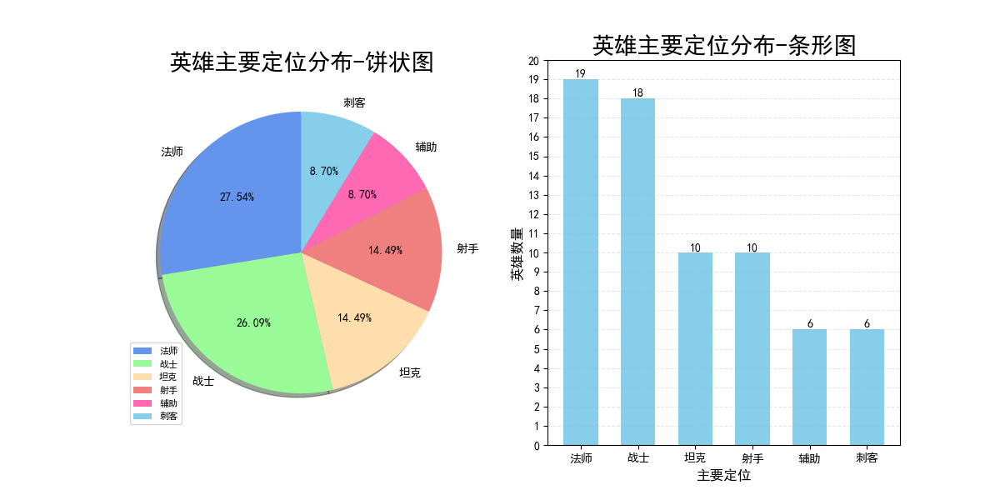
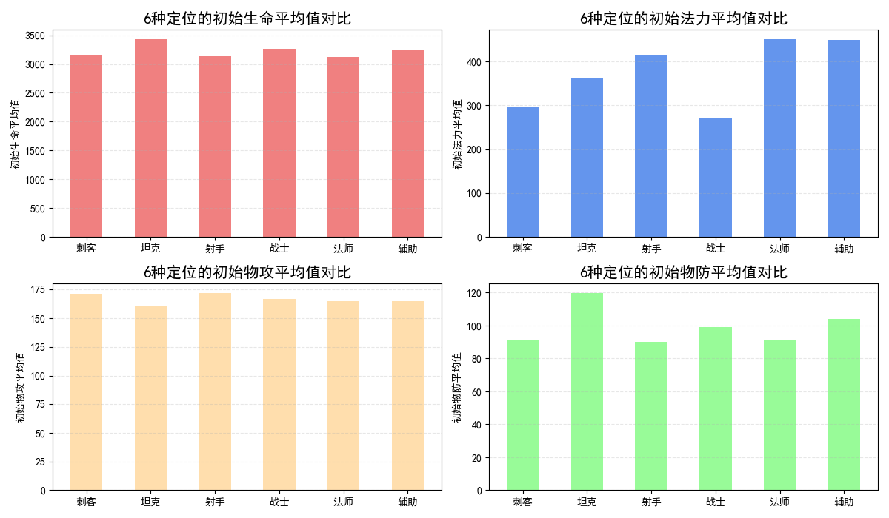
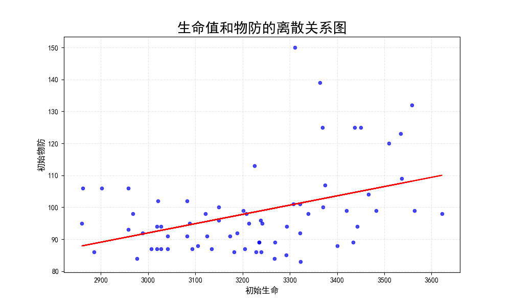
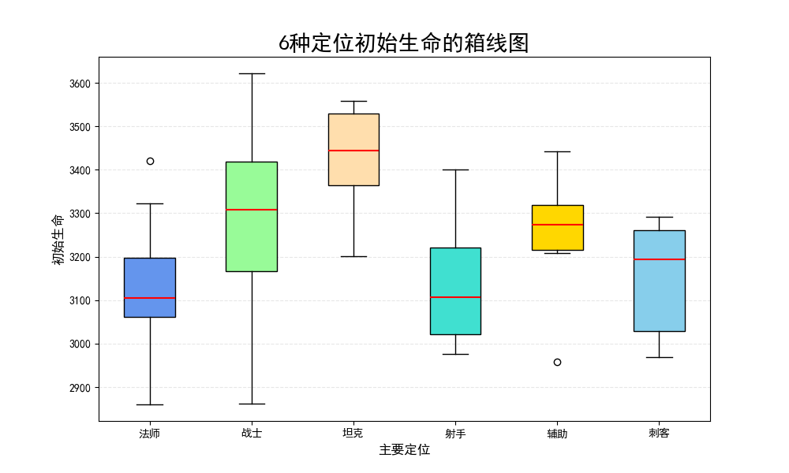

# 🏆 王者荣耀英雄数据分析

基于 Python 的王者荣耀英雄数据分析项目。

## 📖 项目简介

本项目以王者荣耀英雄数据为研究对象，利用 Python 对英雄属性数据进行清洗、统计分析和可视化展示。

通过对不同定位英雄的初始生命、初始法力、初始物攻、初始物防等属性进行分析，探索英雄之间的差异特征，并使用多种图表直观展示分析结果。

本项目旨在实践数据分析的完整流程，包括：

* 数据获取与整理
* 数据清洗
* 数据统计分析
* 数据可视化
* 项目结构化管理

---

## 🛠 开发环境

| 项目       | 环境             |
| -------- | -------------- |
| 操作系统     | Windows 11 x64 |
| 开发工具     | PyCharm        |
| Python版本 | Python 3.14    |
| 数据处理     | Pandas         |
| 数值计算     | NumPy          |
| 数据可视化    | Matplotlib     |

---

## 📂 项目结构

```text
HonorOfKings-DataAnalysis
│
├── README.md
│
├── data/          # 原始数据与清洗后数据
├── role/          # 按英雄定位分类的数据
├── figure/        # 生成的图表
│
└── src/
    ├── clean.py       # 数据清洗
    ├── analysis.py    # 数据分析
    └── visualize.py   # 数据可视化
```

---

## 📊 项目成果展示

### 英雄定位占比分析

（）

### 英雄属性关系分析

（）

### 英雄初始生命与初始物防关系分析

（）

### 英雄初始生命分布分析

（）

---

## 📚 数据来源

本项目所使用的王者荣耀英雄数据来源于和鲸社区公开数据集：

数据集名称：王者荣耀英雄数据集

数据来源：和鲸社区（Heywhale）

链接：
https://www.heywhale.com/mw/dataset/5d22a87b688d36002c54bb91/file

数据仅用于学习交流与数据分析实践，不用于任何商业用途。

---

## 🙏 致谢

感谢和鲸社区提供公开数据集，为数据分析学习和实践提供支持。
